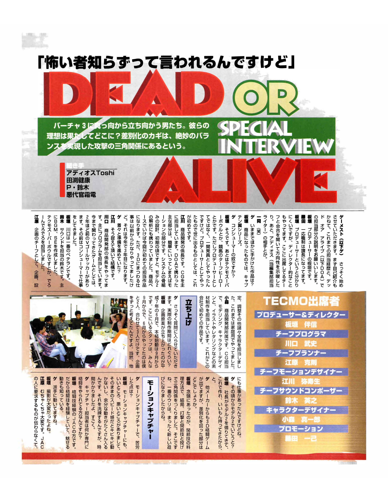
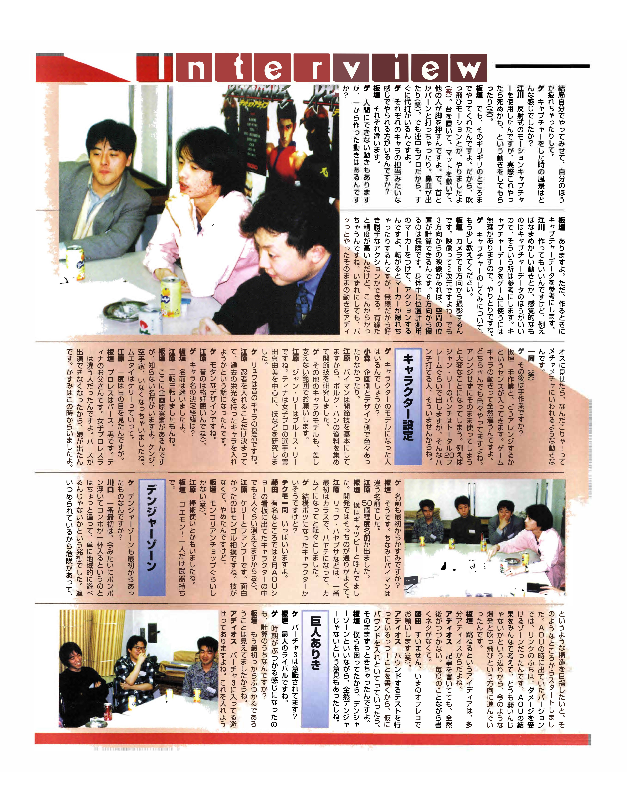
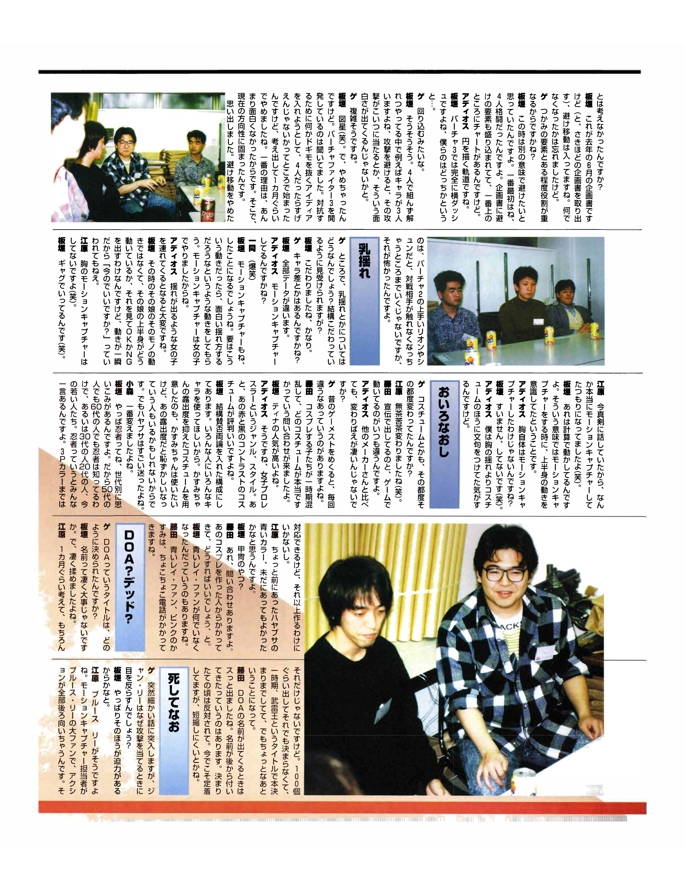
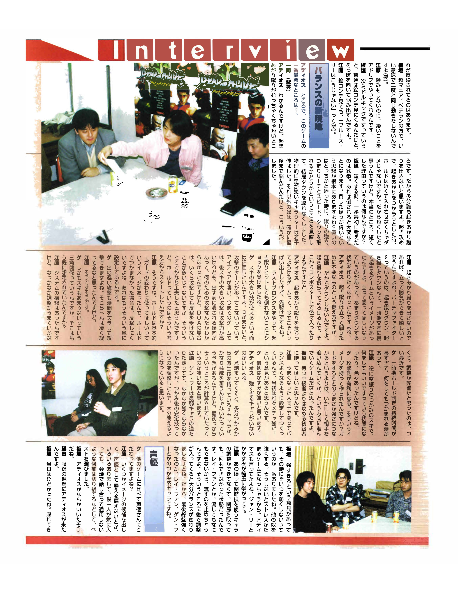
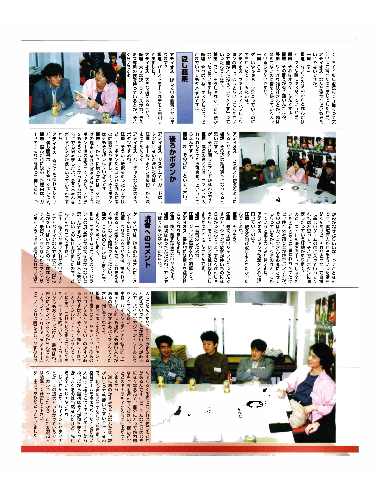

# « On nous dit qu’on n’a peur de rien » : entretien avec l’équipe de *Dead or Alive*

**Source :** *Gamest*, « Dead or Alive Special Interview », pages 88 à 92 du document fourni.  
**Traduction :** traduction française établie à partir des pages japonaises, avec l’aide du texte OCR fourni et de la transcription anglaise préparée précédemment. L’original est composé en colonnes verticales ; les échanges ci-dessous suivent l’ordre de la conversation. Les notes entre crochets apportent des précisions ou signalent une lecture incertaine.

> **Présentation du magazine :** Voici les hommes qui affrontent *Virtua Fighter 3* de front. Jusqu’où vont leurs ambitions ? Selon eux, ce qui distingue leur jeu tient à un triangle d’attaques dont ils ont trouvé le juste équilibre.

Participent à l’entretien **Tomonobu Itagaki** (producteur et directeur), **Kawaguchi** (programmeur en chef), **Ehara** (responsable de la conception du jeu), **Egawa** (responsable de l’animation), **Suzuki** (responsable du son), **Komori** (concepteur des personnages) et **Fujita** (promotion). Les questions sont posées par **Gamest**, avec la participation d’**Adios Toshi**, journaliste du magazine chargé de suivre le jeu.

## Page 1 — L’équipe et les débuts du projet

**Gamest :** Commençons par vous présenter. Sur quels jeux avez-vous travaillé auparavant, et de quelles parties de *Dead or Alive* vous êtes-vous occupés ?

**Itagaki :** Je suis Itagaki, le producteur. Fujita, lui, est officiellement chef de section. Le titre de « producteur » n’est peut-être pas très parlant : je fais aussi un travail qui ressemble à celui d’un directeur. Je réunis les responsables présents ici pour définir la direction à suivre. Et je m’occupe d’Adios, votre journaliste. **Tous :** [Rires.]

**Gamest :** Quels autres jeux avez-vous réalisés ?

**Itagaki :** Parmi ceux qui ont été commercialisés, il y a la série *Captain Tsubasa*.

**Gamest :** Les jeux sur console ?

**Itagaki :** Oui. Il y a aussi *Tecmo Super Bowl* et le jeu de courses hippiques *Turf Hero*. Mais j’y travaillais comme simple développeur, pas comme producteur. *DOA* est le premier jeu que j’ai produit à parvenir jusqu’à sa sortie.

**Egawa :** Je suis chef d’équipe au développement des produits et je travaille surtout sur les images de synthèse. Dans *DOA*, ma principale responsabilité, pour faire simple, est l’animation. J’ai participé à la conception de l’ossature du système et, au début, à l’analyse du matériel Model 2. C’est le premier produit commercial dont je m’occupe, mais cela fait déjà beaucoup de temps que je travaille sur la 3D : j’en suis à ma troisième année.

**Gamest :** Vous vous y prépariez donc depuis un moment ?

**Egawa :** On peut le dire.

**Kawaguchi :** Je suis également chef d’équipe au développement des produits. Je m’occupe principalement de la programmation. Parmi les jeux auxquels j’ai participé, il y a *V Goal Soccer*, il y a environ deux ans. Avant cela, je travaillais sur console.

**Itagaki :** Kawaguchi est le plus expérimenté d’entre nous.

**Suzuki :** Je me suis occupé du son : surtout de la musique de fond et des effets sonores. J’ai travaillé sur *Tecmo Super Bowl* et *Deron Dero Dero*.

**Ehara :** En tant que responsable de la conception, je me suis chargé des idées, des spécifications, des réglages et, plus largement, de tout ce qui relève de ce domaine. Auparavant, je travaillais sur des jeux pour consoles.

**Komori :** Je travaille au développement des produits, sur les images de synthèse : modélisation, création des personnages et production d’éléments graphiques comme les illustrations et le lettrage. C’est mon premier jeu dans cette entreprise.

### Lancement du projet

**Gamest :** Combien de temps a duré le développement proprement dit ?

**Itagaki :** L’idée initiale a pris forme en juin 1995, puis le travail a vraiment commencé en septembre. Toutes les personnes présentes ici ont rejoint le projet en septembre. En juin, nous n’étions que trois, moi et deux autres, à réfléchir au projet, tout en ayant bien sûr d’autres tâches à accomplir.

**Gamest :** Vous comptiez déjà utiliser le Model 2 ?

**Itagaki :** Le président de la société avait apporté une carte Model 2 en nous disant : « Faites un jeu avec ça. Je vous ai trouvé quelque chose de bien. »

**Gamest :** D’autres sociétés proposent aussi des jeux de combat en 3D. Qu’est-ce qui distingue le vôtre ?

**Itagaki :** Nous cherchions une manière d’exploiter les clés articulaires. Nous avons fini par construire une relation triangulaire entre **les coups, les prises ou clés, et les projections**. C’est le principal atout du jeu. Cela a donné une façon de jouer entièrement nouvelle.

### Capture de mouvements

**Gamest :** Quelles difficultés avez-vous rencontrées avec la capture de mouvements ?

**Itagaki :** Elle a ses avantages et ses inconvénients. À la vitesse où ils sont enregistrés, les mouvements manquent de vivacité et contiennent beaucoup de gestes superflus. Il a fallu énormément de temps pour épurer les données.

**Gamest :** Les interprètes étaient-ils des spécialistes des arts martiaux ?

**Itagaki :** C’étaient des membres du JAC [Japan Action Club] ayant une expérience des arts martiaux. Ils connaissaient donc le combat, mais savaient aussi rendre les gestes spectaculaires.

**Gamest :** Les mouvements sont impressionnants.

**Itagaki :** Le tournage a été difficile, n’est-ce pas ?

**Ehara :** Terriblement difficile. Parfois, je n’arrivais pas à expliquer aux interprètes du JAC ce que nous voulions. Je finissais par leur montrer moi-même, et c’était moi qui sortais le plus épuisé de la séance.

## Page 2 — Capture, personnages et Danger Zone

**Gamest :** À quoi ressemblait une séance de capture ?

**Egawa :** Nous avons utilisé un système de capture à marqueurs réfléchissants. Nous leur demandions même de faire des mouvements qui donnaient envie de dire : « Si on fait vraiment ça, on risque d’y laisser sa peau. » [Rires.]

**Itagaki :** Pourtant, ils allaient jusqu’à cette limite pour nous. Nous avons capturé, par exemple, des animations où quelqu’un est projeté au loin. [Rires.] Nous installions une plateforme et des tapis, puis quelqu’un poussait les jambes de l’interprète. Il arrivait qu’il se cogne le cou ou qu’il saigne du nez. Mais ce sont des professionnels : un remplaçant était aussitôt disponible.

**Gamest :** Chaque interprète était-il chargé d’un personnage particulier ?

**Itagaki :** Nous avons fait appel à des personnes différentes selon les personnages.

**Gamest :** Certains mouvements sont impossibles pour un être humain. Avez-vous créé des animations de toutes pièces ?

**Itagaki :** Oui, mais même dans ce cas, nous nous référons aux données capturées.

**Egawa :** Nous pouvons animer nous-mêmes un mouvement. Mais pour certaines impressions difficiles à définir, comme la sensualité d’un geste, les données capturées constituent une meilleure référence. On ne peut pas simplement les insérer telles quelles dans le jeu : c’est un va-et-vient entre capture et travail manuel.

**Gamest :** Pouvez-vous expliquer un peu mieux le fonctionnement de cette capture ?

**Itagaki :** Nous filmons depuis six directions. Une image est en deux dimensions, mais avec des prises de vue depuis trois directions, on peut calculer une position dans l’espace ; les autres caméras servent de sécurité. Les interprètes portent des marqueurs de position sur tout le corps. Quand ils roulent au sol, certains marqueurs peuvent être masqués, mais comme il n’y a pas de fils, ils restent libres de leurs mouvements. Un système filaire est plus précis, mais les fils s’emmêlent. Quoi qu’il en soit, si nous montrions à Adios une action brute, exactement telle qu’elle a été capturée, il s’écrierait : « Mais qu’est-ce que c’est que ça ? » et la descendrait en flammes.

**Gamest :** Vous retravaillez donc tout cela à la main ?

**Itagaki :** À la main, oui, et il faut aussi savoir comment adapter le geste. Le mouvement d’un personnage de jeu est tout à fait différent. Tout le monde dans ce métier procède à des ajustements. Utiliser la capture sans la modifier donnerait un résultat désastreux. Le coup de poing de Jann Lee, par exemple, sort en vingt images environ au total. Il n’y a pas beaucoup de gens capables de donner un coup aussi rapide dans la réalité.

### Création des personnages

**Gamest :** Certains personnages ont-ils été inspirés de personnes réelles ?

**Komori :** Il y a eu différentes sources d’inspiration, du côté de la conception comme du côté du dessin.

**Ehara :** Bayman repose sur les clés articulaires. Nous avons donc rassemblé des documents sur Volk Han et étudié ses techniques.

**Gamest :** Pouvez-vous parler des modèles des autres personnages, dans la mesure du possible ?

**Ehara :** Pour Jann Lee, c’est Bruce Lee. Pour Tina, nous avons surtout étudié les prises et les mouvements de Manami Toyota, une catcheuse professionnelle.

**Gamest :** Ryu, lui, marque le retour d’un ancien personnage.

**Ehara :** Une fois décidés à inclure un ninja, nous nous sommes dit que nous pourrions faire revenir un personnage de notre passé.

**Gamest :** Son apparence est assez moderne.

**Ehara :** L’ancienne n’était pas très réussie. [Rires.]

**Gamest :** Comment avez-vous choisi les noms des personnages ?

**Itagaki :** Nous avons beaucoup hésité.

**Ehara :** Ils ont changé plusieurs fois.

**Itagaki :** J’ai ici la proposition initiale : on y trouve des noms que vous ne reconnaîtrez pas. Il y avait Kenji, un karatéka qui a disparu du projet. Le combattant de muay-thaï s’appelait Kelly.

**Ehara :** Nous lui avons trouvé cinq noms environ.

**Itagaki :** Moi, je l’appelais Gatsby ; c’était le nom que toute l’équipe comprenait. Quant à Ryu Hayabusa, il s’est d’abord appelé Karasu, puis Hayate, puis Kamui, et ainsi de suite.

**Gamest :** Kasumi s’appelait-elle déjà Kasumi ?

**Itagaki :** Oui. Bayman, en revanche, portait un autre nom. Il y avait également un catcheur nommé Bass : c’est un homme, le père de Tina. Au départ, la catcheuse était un personnage différent. Comme Bass ne pouvait plus figurer dans le jeu, sa fille l’a remplacé. Kasumi était déjà présente à cette époque.

**Gamest :** On dirait que beaucoup de personnages ont été abandonnés.

**L’équipe de Tecmo :** Beaucoup, oui.

**Fujita :** Parmi les personnages représentés sur le panneau du salon AOU de février, deux environ avaient déjà disparu. [Rires.]

**Ehara :** Kelly et Fan Fu [nom tel qu’il apparaît sur la page]. Il y avait aussi un lutteur mongol assez amusant. Nous l’avons abandonné faute de lui trouver des techniques.

**Itagaki :** À part une manchette mongole, bien sûr. [Rires.]

**Ehara :** Nous avions aussi imaginé un combattant au bâton.

**Itagaki :** Goemon ! Le seul personnage armé.

**Fujita :** Excusez-nous, mais considérez cette dernière remarque comme confidentielle. [Rires.]

### La Danger Zone

**Gamest :** La Danger Zone existait-elle dès le départ ?

**Kawaguchi :** Au début, elle ne ressemblait pas à la version actuelle, où les personnages rebondissent et peuvent subir de nombreux combos. Nous voulions simplement exploiter les différentes zones de l’arène : être acculé au bord devait représenter un danger. C’était notre point de départ. Dans la version présentée au salon AOU, le bord du ring infligeait des dégâts. Après avoir vu les réactions à AOU, nous avons tous trouvé l’effet trop faible. C’est ce qui nous a conduits aux explosions et aux projections que vous voyez aujourd’hui.

**Itagaki :** L’idée du rebond venait probablement d’Adios, non ?

**Adios :** J’écrivais mon article et, comme d’habitude, je n’avais plus rien à raconter. J’étais à court de sujets.

**Adios :** Je leur ai dit que j’allais écrire qu’ils expérimentaient un rebond, et je leur ai demandé d’en ajouter un provisoirement. Finalement, il est resté dans le jeu.

**Itagaki :** Nous étions bloqués nous aussi. On nous disait que la « Danger Zone » n’avait rien de dangereux.

### Face à un géant

**Gamest :** Pensiez-vous à *Virtua Fighter 3* pendant le développement ?

**Itagaki :** C’était notre plus grand rival.

**Gamest :** Aviez-vous prévu que les deux jeux sortiraient à peu près en même temps ?

**Itagaki :** Nous savions dès le départ que cela risquait d’arriver.

**Adios :** *Virtua Fighter 3* comporte un mouvement d’esquive. Avez-vous envisagé d’en inclure un ?

**Itagaki :** Voici notre projet de juin dernier. [Il ressort le document évoqué plus tôt.] On y trouve bien un déplacement d’esquive. Je ne me souvenais plus pourquoi nous l’avions supprimé.

**Gamest :** Remplissait-il en partie le même rôle que les prises défensives ?

**Itagaki :** À l’époque, nous entendions autre chose par « esquive ». Dans sa toute première version, le projet mettait **quatre combattants en jeu simultanément**. Le document comprenait des esquives ; il y a un schéma en haut.

**Adios :** Avec une trajectoire circulaire.

**Itagaki :** Dans *VF3*, c’est un déplacement latéral tout droit. Chez nous, c’était plutôt...

**Gamest :** Un mouvement pour contourner l’adversaire ?

**Itagaki :** Exactement. Imaginez trois des quatre combattants aux prises les uns avec les autres. L’un esquive une attaque et celle-ci touche un autre personnage. Cela nous paraissait amusant.

**Gamest :** Cela semble compliqué.

**Itagaki :** Vous avez mis le doigt dessus. [Rires.] Nous avons donc abandonné l’idée. Nous savions que *Virtua Fighter 3* était en développement et nous cherchions quelque chose de suffisamment étonnant pour lui tenir tête : quatre combattants, cela semblait spectaculaire ! Mais nous y avons renoncé au bout d’un mois environ. La principale raison, c’est que ce n’était pas très amusant. C’est alors que nous avons adopté la direction actuelle.

## Page 3 — Esquive, mouvements des personnages et choix du titre

**Itagaki :** Je me souviens maintenant de la raison pour laquelle nous avons supprimé le déplacement d’esquive. Dans *Virtua Fighter 2*, contre quelqu’un qui maîtrise vraiment Lion ou Shun, on peut finir par ne plus pouvoir le toucher du tout. Cette possibilité nous faisait peur.

### Mouvement des personnages

**Gamest :** Qu’en est-il du mouvement de la poitrine des personnages féminins ? Vous semblez y avoir consacré beaucoup de travail.

**Itagaki :** C’est vrai.

**Gamest :** Les réglages varient-ils d’un personnage à l’autre ?

**Itagaki :** Toutes les données sont différentes.

**Adios :** Vous l’avez capturé en mouvement ?

**Tous :** [Rires gênés.]

**Itagaki :** D’une certaine manière, on pourrait le dire. Nous avons demandé à l’interprète de bouger de façons qui produiraient un effet intéressant. Nous avons capturé les mouvements des femmes.

**Adios :** Il ne devait pas être facile de trouver une femme dont les mouvements produiraient un effet assez marqué.

**Itagaki :** Nous ne jugions pas le mouvement de sa poitrine. Nous regardions la façon dont bougeait le haut de son corps pour décider si une prise convenait. Mais tout se passe en un instant : quand on nous demandait « Celle-là vous va ? », c’était difficile à dire.

**Ehara :** Nous n’avons **pas** capturé le mouvement de la poitrine. [Rires.]

**Itagaki :** J’étais tellement pris par mon explication que j’ai presque fini par y croire. [Rires.] Ce mouvement est calculé. Ce que je voulais dire, c’est que nous prêtions attention au mouvement du haut du corps pendant la capture.

**Adios :** La poitrine elle-même n’a donc pas été capturée ?

**Itagaki :** Non, désolé. [Rires.]

### Changements de costumes

**Adios :** Je crois que je me plaignais davantage des costumes que des mouvements de la poitrine.

**Gamest :** Les costumes changeaient-ils sans arrêt ?

**Ehara :** Énormément. [Rires.]

**Fujita :** Les vêtements montrés dans nos publicités étaient toujours différents de ceux que portaient les personnages dans le jeu.

**Adios :** Les changements semblent particulièrement importants par rapport aux jeux des autres éditeurs.

**Gamest :** Quand on feuillette les anciens numéros de *Gamest*, les personnages sont différents à chaque fois.

**Fujita :** À un moment, les personnes qui fabriquaient des costumes de cosplay étaient si perdues qu’elles nous ont contactés pour savoir quelle était la tenue définitive.

**Itagaki :** Tina est populaire, non ?

**Adios :** Oui : c’est une catcheuse, avec la silhouette qui va avec. Les gens aiment aussi le contraste entre le rouge et le noir de sa tenue.

**Itagaki :** Nous avons volontairement prévu des modèles susceptibles de diviser les avis. Nous voulons que chacun puisse trouver un personnage qui lui plaise. Nous avons créé une tenue moins révélatrice pour Kasumi : quelqu’un pourrait vouloir jouer avec elle tout en étant gêné par l’autre costume. Mais Hayabusa nous a donné beaucoup de fil à retordre.

**Komori :** C’est lui que nous avons le plus modifié.

**Itagaki :** Chaque génération a sa propre idée du ninja. Les quinquagénaires et les sexagénaires connaissent les ninjas, tout comme les personnes dans la vingtaine ou la trentaine, et les plus jeunes encore. Tout le monde a son opinion. Nous pouvons en satisfaire quelques-unes avec trois variantes de couleur, mais pas en créer indéfiniment.

**Ehara :** Je me dis parfois que nous aurions pu conserver la version bleue d’Hayabusa que nous avions il y a quelque temps.

**Itagaki :** Celle avec l’armure ?

**Fujita :** On nous pose encore des questions à son sujet. Quelqu’un qui en avait fabriqué le costume pour du cosplay a appelé pour demander ce qu’il était censé faire maintenant.

**Itagaki :** Certains demandent aussi pourquoi la Leifang en bleu a disparu.

**Fujita :** Nous recevons de temps en temps des appels au sujet de Leifang en bleu et de Kasumi en rose.

### « DOA ? Dead ? »

**Gamest :** Comment avez-vous choisi le titre *DOA* ?

**Itagaki :** Un nom est extrêmement important. Il a donc suscité beaucoup de débats.

**Ehara :** Nous y avons réfléchi pendant environ un mois et proposé une centaine de possibilités sans nous décider. À un moment, nous avions même arrêté notre choix sur *武雷王*, avant de nous raviser. [Le document ne donne pas la prononciation prévue pour ce titre abandonné.]

**Fujita :** En revanche, *DOA* nous est venu très naturellement. Le nom est arrivé après le jeu. Quand nous venions de le choisir, certaines personnes s’y opposaient. Il s’est imposé depuis, mais on lui reprochait notamment de ne pas se prêter facilement à une abréviation.

### Même dans la mort...

**Gamest :** Une question soudain très précise : pourquoi Jann Lee détourne-t-il les yeux lorsqu’il porte un coup ?

**Itagaki :** Peut-être parce que cela donne plus d’impact à l’image.

**Ehara :** Bruce Lee le faisait aussi. L’interprète chargé de la capture était un grand admirateur de Bruce Lee ; dans ses mouvements, il finissait toujours par se tourner. Cela s’est retrouvé dans le jeu.

**Itagaki :** C’était un véritable passionné. Un vétéran qui, dans le bon sens du terme, ne répétait jamais deux fois exactement le même mouvement. [Rires.]

**Ehara :** Il improvisait des choses incroyables sans qu’on le lui demande.

**Itagaki :** Quand on lui disait : « Maintenant, un coup de pied à mi-hauteur », un interprète ordinaire aurait regardé le storyboard. Lui se détournait et se mettait à réfléchir.

**Ehara :** Même après avoir vu le storyboard, il disait : « Bruce Lee ne ferait pas comme ça ! » [Rires.]

## Page 4 — Équilibrage, prises et comédiens de doublage

### Un nouvel équilibre

**Adios :** Alors, le pire défaut de ce jeu, c’est...

**Tous :** [Rires surpris.]

**Adios :** Je comprends l’idée, mais la portée du coup de pied au relevé est incroyablement courte. Je ne pense pas que les joueurs vont l’utiliser. J’imagine que vous l’avez raccourcie pour qu’on puisse saisir l’adversaire de près pendant qu’il se relève et utiliser une prise défensive. Mais quelle est la vraie raison ?

**Itagaki :** Quand nous avons songé à le raccourcir, nous avons d’abord pensé à *Tekken*. Dans ce jeu, se retrouver au sol vous met vraiment en difficulté. Le principe, c’est que celui qui réussit à faire tomber l’autre mérite l’avantage. Il fallait décider lequel des deux joueurs devait être favorisé chez nous. Nous avons revu la portée, la vitesse et la capacité du coup à faire tomber l’adversaire. Finalement, nous avons supprimé le renversement. Nous avons légèrement augmenté la portée chez les personnages qui ont physiquement les jambes courtes. Pour les autres, nous avons hésité jusqu’au bout, mais c’est la solution que nous avons retenue.

**Ehara :** Si les joueurs n’utilisent pas les coups de pied au relevé, cela me convient : ils pourront se battre debout. Pendant un temps, *Virtua Fighter 2* donnait l’impression que les joueurs tombaient et se relevaient à tour de rôle après chaque coup de pied au relevé. Nous voulions qu’ils se battent debout, sans multiplier les situations où quelqu’un se retrouve au sol.

**Adios :** Vous voyez donc ces coups de pied comme un obstacle au combat debout ?

**Ehara :** Voilà pourquoi ils ne font pas tomber. Le joueur touché vacille ; cela peut même lancer un combo, mais il reste debout.

**Adios :** Il existe aujourd’hui plusieurs jeux où le coup de pied au relevé fait chanceler l’adversaire. Vous faisiez figure de précurseurs.

**Ehara :** J’ai été surpris quand j’ai joué à *Last Bronx* : même lorsqu’un coup de pied au relevé touchait, l’adversaire ne tombait pas.

**Gamest :** J’apprécie aussi que les techniques comportant de grandes ouvertures restent utilisables. L’idée que l’adversaire ne récupère pas son tour d’attaque tant qu’il ne vous a pas saisi est remarquable. Dans les jeux précédents, les attaques puissantes mais lentes étaient souvent interrompues avant même de sortir : on finissait par se demander à quoi elles servaient. Dans *DOA*, on peut souvent continuer à attaquer sans se faire punir. Le système de prises défensives est-il né de ce raisonnement ?

**Ehara :** Oui. Dans une certaine mesure, nous voulions que les prises défensives servent à la place de la garde. Quand on manque sa prise, il devient difficile de riposter. C’est voulu.

**Gamest :** On peut aussi décaler une attaque lente pour varier le rythme. On sent que vous y avez beaucoup réfléchi.

**Ehara :** Tout à fait.

**Gamest :** Et beaucoup d’attaques laissent peu d’ouverture après leur exécution. Aviez-vous déjà imaginé ce triangle de possibilités ?

**Ehara :** Le concept du système était là, mais le réglage a été extrêmement difficile. Ce n’est que tout récemment que j’ai estimé l’équilibre satisfaisant.

**Gamest :** À une époque, la fenêtre d’activation des prises défensives était si longue qu’elles semblaient attraper n’importe quoi.

**Ehara :** Il y a aussi eu l’extrême inverse : manquer une saisie vous exposait à toutes les attaques possibles. Nous sommes passés par toutes sortes de réglages.

**Gamest :** Vouliez-vous donner l’avantage à celui qui attaque ? J’ai l’impression que le jeu récompense davantage la capacité à acculer l’adversaire que l’attente en défense.

**Itagaki :** Je préférerais voir un débutant qui attaque battre un joueur intermédiaire qui se contente d’attendre.

**Ehara :** Nous avons réglé le jeu pour qu’il soit équilibré entre deux joueurs expérimentés. Au début, certains diront donc probablement qu’un personnage est beaucoup trop fort.

**Gamest :** Au départ, Kasumi paraît forte.

**Adios :** Ce qui est bien, c’est qu’aucun personnage ne semble excessivement puissant.

**Gamest :** Je suppose qu’une fois le jeu bien connu, les deux personnages dotés de techniques enchaînées après une saisie deviendront redoutables. Je trouve impressionnant que vous y ayez pensé dès le début.

**Ehara :** Gen Fu est longtemps resté le plus faible ; nous avions du mal à le renforcer. Nous avons réglé les techniques fiables qu’il peut employer après une saisie. Je pense qu’il pourra désormais bien mieux se défendre.

**Itagaki :** Nous avions décidé une chose : lorsqu’on nous disait qu’un personnage était trop fort, nous ne l’affaiblissions pas. Nous renforcions les autres. Sinon, le jeu devient frustrant. Adios l’avait dit aussi, lorsque Jann Lee et Kasumi étaient montrés du doigt.

**Ehara :** À ce moment-là, les personnages utilisant les clés articulaires n’avaient pas encore été équilibrés. Même en saisissant un membre, ils ne pouvaient rien faire. Leifang, par exemple, ne gagnait rien à dévier une attaque, si bien que les joueurs cessaient de s’en servir. Quand nous avons corrigé cela, l’équilibre a nettement changé. Parmi les personnages devenus plus forts vers la fin du développement, il y a donc Leifang et Gen Fu, qui reposent beaucoup sur les prises.

### Choix des voix

**Gamest :** Comment avez-vous choisi les comédiens de doublage ?

**Ehara :** Nous avons dressé une liste de candidats correspondant à l’image que nous nous faisions des personnages. Il fallait ensuite voir s’il était possible de les engager, et si un candidat que j’aimais personnellement convaincrait le reste de l’équipe lors de la réunion. Nous avons écarté ceux qui ne passaient pas cette étape pour retenir les meilleurs.

**Itagaki :** Adios a l’air de vouloir dire quelque chose.

**Fujita :** Il est venu à la séance d’enregistrement.

**Itagaki :** Ce jour-là, il a été terrible. Il est arrivé en retard, a feuilleté un annuaire des idoles, a mangé son repas, s’est plaint et est reparti.

**Adios :** Vous me faites passer pour quelqu’un d’affreux.

**Itagaki :** Mais sa sévérité est une bonne chose : il nous dit quand quelque chose ne va pas.

**Fujita :** Cela nous convient.

**Itagaki :** Nous lui en sommes reconnaissants.

**Fujita :** Il y a parfois des gens de la presse qui n’aiment pas ce qu’ils ont vu, mais qui repartent en nous couvrant d’éloges. **Tous :** [Rires.]

**Gamest :** Du genre « Euh... oui... » [Rire gêné.] Puis « C’était formidable ! »

**Adios :** Quand j’ai vu le jeu pour la première fois, on m’a demandé mon avis sincère. J’ai répondu : « Ça ne va pas. » [Rires.]

**Fujita :** Sans cette franchise, je ne crois pas que nous aurions continué de la même manière.

**Itagaki :** Ce qui est mauvais reste mauvais, quel que soit le temps qu’on y consacre.

## Page 5 — Secrets, commandes et dernières paroles

### Éléments cachés

**Adios :** Y a-t-il des éléments secrets ?

**Itagaki :** Le mode Burst est expliqué dans la démonstration.

**Adios :** Et des techniques particulièrement spectaculaires ?

**Itagaki :** De grosses techniques... Le boss final possède, par exemple, des mouvements qui lui sont propres. À peu près cela.

**Adios :** Pourra-t-on jouer avec le boss final ?

**Itagaki :** Je pense que les choses se passeront comme vous l’espérez.

**Gamest :** En entrant un code secret ?

**Itagaki :** Nous trouvons dommage de priver quelqu’un d’une possibilité parce qu’il ne parvient pas à entrer un code.

**Fujita :** Arrêtons-nous là sur ce sujet.

### Garde en arrière ou bouton dédié ?

**Adios :** Pourquoi avoir décidé de ne pas consacrer un bouton à la garde ?

**Ehara :** Nous avions choisi dès le départ d’avoir un bouton pour les prises défensives.

**Adios :** *Virtua Fighter 3*, par exemple, dispose de quatre boutons.

**Ehara :** C’était une possibilité, mais quatre boutons posent des problèmes de compatibilité avec les panneaux de commande des bornes d’arcade. De plus, le quatrième bouton est difficile à atteindre.

**Itagaki :** Passer d’un bouton à deux doit se justifier. Chaque bouton compte. C’est aussi vrai quand on passe de deux à trois, et encore davantage de trois à quatre. Pourtant, nous avons beaucoup hésité : tous ceux que nous rencontrions réclamaient un bouton de garde.

**Adios :** Je m’y suis habitué, mais au début, je lançais une prise défensive dès l’ouverture du round !

**Itagaki :** Ce qui m’a finalement convaincu, c’est qu’un joueur voulant se mettre en garde pourrait se tromper et déclencher une prise défensive. Plusieurs personnes m’ont raconté l’avoir fait. Une telle erreur peut les amener naturellement à découvrir une nouvelle manière de jouer. C’est ce qui nous a conduits à conserver le bouton H.

**Adios :** Pourquoi avoir inclus des attaques sautées ?

**Itagaki :** Nous voulions un coup de pied sauté vraiment utile.

**Ehara :** Au départ, les personnages sautaient très haut, ce qui rendait les attaques sautées inutilisables. Nous avons alors cherché à rendre le coup de pied sauté pratique.

**Itagaki :** Cela nous a donné énormément de travail.

**Ehara :** Nous avons réglé la hauteur du saut de toutes sortes de façons.

**Adios :** Vous avez fini par empêcher les personnages de sauter par-dessus l’adversaire.

**Ehara :** Ils n’avaient aucune raison de le faire.

**Itagaki :** À l’origine, si, mais cette possibilité n’a pas plu.

**Itagaki :** Dans *Street Fighter II* aussi, on se protège en maintenant la direction arrière, non ? On nous traite parfois de téméraires, mais nous nous sommes inspirés de Capcom pour les coups de pied et de poing sautés. Notre jeu met plutôt l’accent sur les interactions verticales.

### Un mot pour les lecteurs

**Gamest :** Pourriez-vous adresser chacun un dernier mot à nos lecteurs ?

**Ehara :** Les prises sont l’un des principaux atouts du jeu. Plus vous les maîtriserez, plus elles deviendront puissantes. Apprenez à bien vous en servir.

**Suzuki :** Le CD de la bande originale est sorti. J’espère que vous l’écouterez.

**Kawaguchi :** Au début, il sera peut-être difficile de juger si ce jeu est bien équilibré, mais je vous assure que c’est le cas ! Nous en avons fait un bon jeu, alors jouez-y à fond.

**Egawa :** J’ai un attachement particulier à Tina et Bayman. J’ai créé beaucoup de projections. Au début, Bayman possédait des techniques qui n’avaient rien à voir avec le sambo de combat ; nous les avons progressivement modifiées. J’ai beaucoup travaillé sur lui : servez-vous de Bayman pour terrasser un Jann Lee, par exemple.

**Komori :** Tina et Bayman sont également les personnages qui me tiennent le plus à cœur, tant pour leur apparence que pour leurs techniques. Servez-vous-en pour terrasser Kasumi. Je viens de dire la même chose, non ? [Rires.]

**Itagaki :** Avant de conclure, un mot sur Jann Lee. Il possède quatre techniques dont le nom contient « Dragon quelque chose ». Si vous réussissez à placer les quatre, nous appelons cela un « cycle hit ». [Rires.] Essayez donc ! Plus généralement, comme Kawaguchi l’a dit, l’équilibre ne sera peut-être pas évident au début. On pourra avoir l’impression que Jann Lee gagne en criant « Atcha ! » et que Kasumi gagne en tournoyant. Mais cela ne durera pas. Choisissez un personnage qui vous plaît : nous avons fait en sorte qu’ils soient tous efficaces quand on apprend à bien les jouer.

**Itagaki :** Kasumi est facile à prendre en main, c’est pourquoi je la recommande aux débutants. Nous l’avons conçue pour les gens qui n’avaient jamais joué à un jeu de combat. Qu’elle puisse beaucoup bouger et gagner au début est naturel ; par la suite, cela deviendra peut-être plus difficile pour elle. Le vieil homme [Gen Fu], Bayman et Tina sont des personnages plus techniques : si vous les choisissez, entraînez-vous bien.

**Gamest :** Merci à tous pour cet entretien.

---

### Notes de traduction et images

- **Images :** les cinq images sont les scans complets des pages de l’entretien : `DOA1_Gamest_page_01.jpg` à `DOA1_Gamest_page_05.jpg`. Placez-les dans le même dossier que ce fichier Markdown pour les afficher dans le texte. Elles correspondent, dans le même ordre, aux pages du PDF fourni, `doa57OCR_pg88-92(1).pdf`.
- **Dates :** juin 1995 correspond à 平成7年6月. Le « juin dernier » évoqué à propos de la proposition initiale renvoie à la même période.
- **Vocabulaire :** l’entretien utilise souvent つかみ, littéralement « saisie », pour parler du mécanisme de prise ou de contre. Selon le contexte, j’emploie « saisie », « prise » ou « prise défensive ». Le « triangle » associe coups, prises ou clés, et projections. Le « coup de pied au relevé » traduit 起きあがり蹴り / 起き蹴り.
- **Lectures incertaines :** le nom du personnage retiré apparaît comme ファンフー, transcrit ici **Fan Fu**. Le titre abandonné est écrit **武雷王**, sans prononciation indiquée. Plusieurs prénoms de la liste des participants et certaines signatures du magazine sont difficiles à lire ; les échanges utilisent donc les noms de famille.
- **Ordre des échanges :** l’OCR mélange parfois les colonnes verticales, notamment pour la Danger Zone, le projet à quatre combattants, les mouvements de la poitrine et la discussion sur les commandes. L’ordre a été rétabli à l’aide des images des pages. Les précisions entre crochets sont ajoutées par la traduction.
